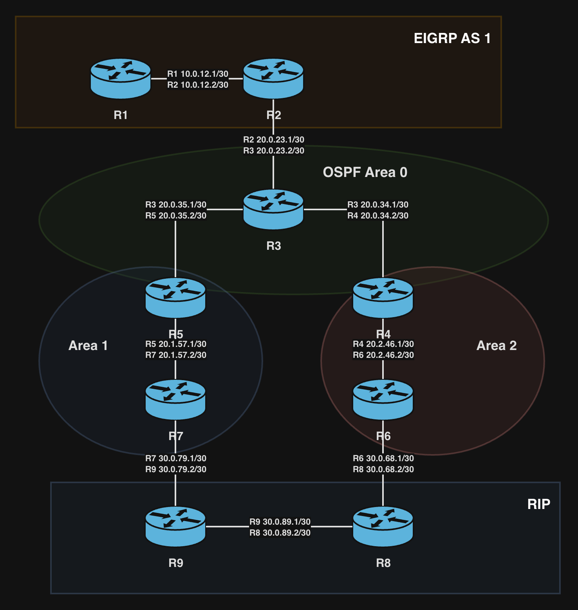

# B-Multi-Protocol Redistribution and Route Tagging

This is a bigger ENARSI-style lab. It is not just a small two-router check; it combines redistribution, multi-area OSPF, and route tagging across EIGRP, OSPF, and RIP.

The `B-` prefix marks it as a larger combined-topic lab. In this repository, that means the topology has more moving parts than a focused mini-lab and the README should capture the design idea, not only the commands.



## What This Lab Covers

- EIGRP and OSPF mutual redistribution
- OSPF and RIP mutual redistribution
- Multi-area OSPF with Area 0, Area 1, and Area 2
- OSPF external routes and external route tags
- RIPv2 redistribution seed metrics
- EIGRP redistribution seed metrics
- Route-map based tagging and filtering

## Topology Summary

- R1-R2: EIGRP AS 1 over `10.0.12.0/30`
- R2-R3-R4-R5: OSPF Area 0 core
- R5-R7-R9: OSPF Area 1 path toward the RIP boundary
- R4-R6-R8: OSPF Area 2 path toward the RIP boundary
- R8-R9: RIPv2 domain over `30.0.89.0/30`

Redistribution points:

- R2: EIGRP `<->` OSPF
- R8: OSPF `<->` RIP
- R9: OSPF `<->` RIP

## Route Tags

The lab uses route tags as route origin markers during redistribution:

| Tag | Meaning |
| --- | --- |
| `90` | Route originated from EIGRP |
| `110` | Route originated from OSPF |
| `120` | Route originated from RIP |

The practical rule:

```text
When redistributing routes into a protocol, deny routes already tagged as that destination protocol.
Then permit the remaining routes and tag them with the source protocol.
```

Examples:

```text
OSPF -> RIP:
 deny tag 120
 set tag 110

RIP -> OSPF:
 deny tag 110
 set tag 120

EIGRP -> OSPF:
 deny tag 110
 set tag 90

OSPF -> EIGRP:
 deny tag 90
 set tag 110
```

## Configuration Snapshots

The `final/` folder contains the exported router configs after route tagging was applied.

The `initial/` folder has empty `R1.cfg` through `R9.cfg` placeholders. I did not have a clean pre-tagging export for this run, so I kept the initial side intentionally empty instead of pretending there was a baseline that was never captured.

The useful checkpoint for this lab is the final state: R2, R8, and R9 all have redistribution route-maps attached, with tags used to stop route feedback.

## Verification Commands

Check redistribution and route-map attachment:

```text
show ip protocols
show route-map
show running-config | section router
show running-config | section route-map
```

Check OSPF external LSAs and route tags:

```text
show ip ospf database external
show ip ospf database external <prefix>
```

Look for:

```text
External Route Tag: 90
External Route Tag: 120
```

Check RIP database and RIP-learned routes:

```text
show ip rip database
show ip route rip
show ip route <prefix>
```

Useful connectivity checks:

```text
show ip route
show ip ospf neighbor
show ip eigrp neighbors
traceroute <destination>
ping <destination>
```

## Lab Notes

The main value of this lab is seeing how redistribution behaves when there is more than one edge between routing domains. Basic reachability is only half the story here. The cleaner goal is making sure routes do not get fed back into the protocol they originally came from.

- OSPF carries internal, inter-area, and external knowledge.
- RIP requires an explicit seed metric when OSPF routes are redistributed into it.
- EIGRP requires the full seed metric when OSPF routes are redistributed into it.
- Tags do not mark packets. They mark redistributed route entries so another redistribution point can recognize where the route originally came from.
- The route-map names describe the redistribution direction, while the tag value records route origin.

One IOS detail to remember here: RIP network statements are classful. A command like `network 30.0.0.0` can enable RIP on every active `30.x.x.x` interface on that router, not only on one `/30` link. In the exported configs, the actual mutual redistribution points are still R8 and R9; `show ip protocols` is the best way to confirm exactly where RIP is active.
