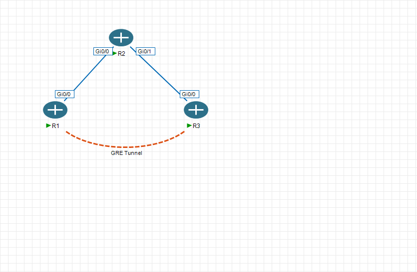

# GRE Tunnel Recursive Routing Error

This lab is about a GRE tunnel between R1 and R3, with R2 sitting in the middle.



## What I Built

Physical path:

```text
R1 --- R2 --- R3
```

Logical tunnel:

```text
R1 === GRE Tunnel === R3
```

The tunnel uses loopbacks as endpoints:

- R1 tunnel destination: `3.3.3.3`
- R3 tunnel destination: `1.1.1.1`

That means R1 must already know how to reach `3.3.3.3`, and R3 must already know how to reach `1.1.1.1`, before the tunnel can stay up.

## What Confused Me

At first, Tunnel1 showed as `up/up`, so it looked like everything was fine.

Then the logs showed:

```text
%TUN-5-RECURDOWN: Tunnel1 temporarily disabled due to recursive routing
```

That made the issue clearer: the tunnel was not simply up or down. It was flapping.

## What Was Actually Happening

Before enabling RIP on the tunnel, the routers reached each other's loopbacks through R2.

That is good:

```text
R1 -> 3.3.3.3 via R2
R3 -> 1.1.1.1 via R2
```

After enabling RIP on the tunnel, the routers could learn a better route through Tunnel1.

That is bad:

```text
R1 -> 3.3.3.3 via Tunnel1
R3 -> 1.1.1.1 via Tunnel1
```

The tunnel needs the loopback route to work, but the route points back into the tunnel. So the router ends up with this logic:

```text
To bring up the tunnel, reach the remote loopback.
To reach the remote loopback, use the tunnel.
```

That is recursive routing.

## How To Check It

Useful commands:

```text
show ip route 3.3.3.3
show ip route 1.1.1.1
show ip interface brief | include Tunnel
show logging | include RECUR
```

The important thing is where the tunnel endpoint route points.

Correct:

```text
3.3.3.3 via R2
1.1.1.1 via R2
```

Wrong:

```text
3.3.3.3 via Tunnel1
1.1.1.1 via Tunnel1
```

## Fix

The fix is to keep tunnel endpoint reachability on the real path.

Static route option:

```text
R1(config)#ip route 3.3.3.3 255.255.255.255 192.168.12.2
R3(config)#ip route 1.1.1.1 255.255.255.255 192.168.23.1
```

Metric option with RIP:

```text
router rip
 offset-list 0 in 3 tunnel 1
```

The offset-list makes routes learned through Tunnel1 worse, so the router keeps using the physical route through R2 for the tunnel endpoints.

## Takeaway

A GRE tunnel is a fake direct link. It still needs a real route underneath it.

The route to the tunnel destination must not point into the tunnel itself.

## Files

- `initial/` empty starting configs
- `final/` completed configs
