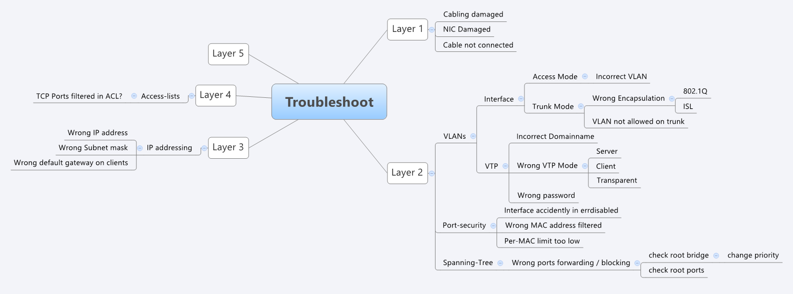

# Troubleshooting Routing

This folder is for ENARSI routing troubleshooting methodology and troubleshooting-focused labs.

## Troubleshooting Flow

- Define the problem
- Check expected state
- Check observed state
- Follow the path
- Compare working vs broken behavior
- Isolate the fault
- Apply the smallest fix
- Verify the fix

## Case Evidence Format

Each troubleshooting case should show:

- `initial/` baseline configs
- `final/` corrected configs
- `topology.png`
- `README.md` with symptoms, root cause, fix, and verification
