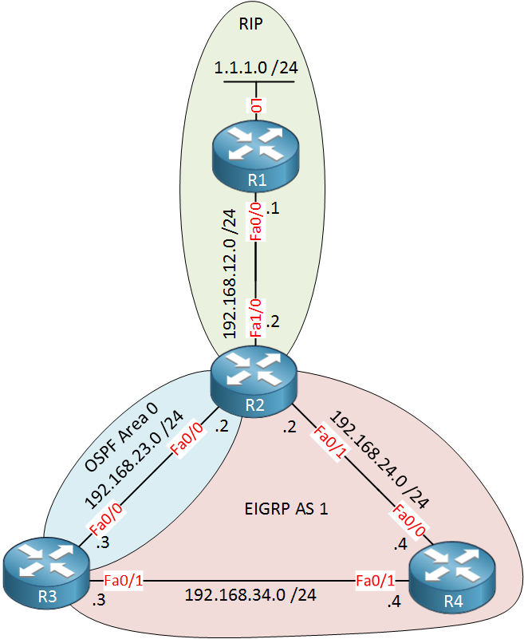

# Troubleshooting AD Redistribution with Route Tags

This lab is about an administrative distance redistribution issue.

`1.1.1.0/24` starts in RIP on R1. R2 learns it from RIP, redistributes it into EIGRP, R3 learns it through EIGRP, then R3 redistributes it into OSPF.

The bad part is that R2 can learn the same route back as OSPF:

```text
O E2 1.1.1.0/24 [110/20] via 192.168.23.2
```

OSPF AD `110` beats RIP AD `120`, so R2 removes the real RIP route. Then R2 stops redistributing it into EIGRP, so the route disappears from R4/R3, and the whole thing repeats.




## Problem

Bad route feedback:

```text
RIP -> EIGRP -> OSPF -> back to R2
```

R2 should use:

```text
R 1.1.1.0/24 [120/1] via 192.168.12.1
```

But when the route comes back through OSPF, R2 prefers:

```text
O E2 1.1.1.0/24 [110/20] via 192.168.23.2
```

## Fix

Tag RIP routes when they enter EIGRP on R2:

```text
route-map RIP_TO_EIGRP permit 10
 set tag 120
```

Block that tag on R3 when EIGRP is redistributed into OSPF:

```text
route-map EIGRP_TO_OSPF deny 10
 match tag 120

route-map EIGRP_TO_OSPF permit 20
 set tag 90
```

Meaning:

```text
tag 120 = originally from RIP
tag 90  = originally from EIGRP
```

## Verification

R2 should keep the RIP route:

```text
show ip route 1.1.1.0
```

Expected:

```text
R 1.1.1.0/24 [120/1] via 192.168.12.1
```

R3 should not create an OSPF external LSA for `1.1.1.0/24`:

```text
show ip ospf database external 1.1.1.0
```

Check route-map and tags:

```text
show route-map
show ip eigrp topology 1.1.1.0/24
show ip route profile
debug ip routing
```

Full ping test:

```text
tclsh
foreach address {1.1.1.1 192.168.12.1 192.168.12.2 192.168.23.1 192.168.23.2 192.168.24.1 192.168.24.2 192.168.34.1 192.168.34.2} {ping $address repeat 3}
```
