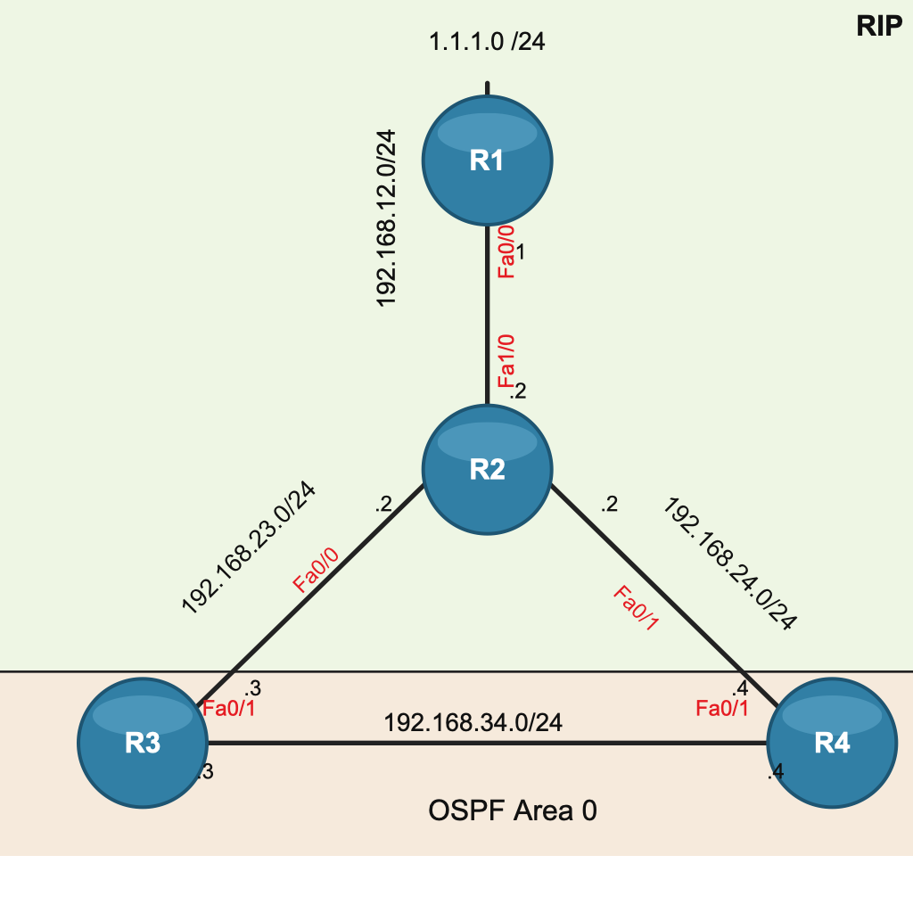

# Troubleshooting Metric Redistribution with Route Tags

This lab is about a small RIP/OSPF redistribution problem that gets confusing pretty fast once the same prefix is allowed to leave RIP, enter OSPF, and then come back into RIP again.

The topology is intentionally simple: R1 advertises `1.1.1.0/24` into RIP, R2 sits in the middle, and R3/R4 run both RIP and OSPF so they can act as redistribution points.



## Topology

- R1-R2: `192.168.12.0/24`
- R2-R3: `192.168.23.0/24`
- R2-R4: `192.168.24.0/24`
- R3-R4: `192.168.34.0/24`
- R1 Loopback0: `1.1.1.0/24`

RIP runs on the R1-R2-R3/R4 side. OSPF only runs between R3 and R4 on `192.168.34.0/24`.

R3 and R4 redistribute between RIP and OSPF, so in OSPF terms they are ASBRs. They are not ABRs here because there is only one OSPF area.

## What I Was Testing

The broken design is this:

```text
RIP -> OSPF -> RIP
```

That means a route that originally came from RIP can be redistributed into OSPF and then redistributed back into RIP with a new metric.

In this lab, R1 uses:

```text
offset-list 0 out 5
```

That makes the normal RIP path to `1.1.1.0/24` look worse. If the same prefix comes back from R3 or R4 with:

```text
redistribute ospf 1 metric 1
```

then RIP can prefer the recycled route instead of the real path toward R1. That is the whole metric redistribution problem.

## The Fix

I used a route tag to remember which routes came from RIP before they entered OSPF.

On R3 and R4, RIP routes are tagged when they are redistributed into OSPF:

```text
route-map RIP_TO_OSPF permit 10
 set tag 111

router ospf 1
 redistribute rip subnets route-map RIP_TO_OSPF
```

Then OSPF routes with that tag are blocked from going back into RIP:

```text
route-map OSPF_TO_RIP deny 10
 match tag 111

route-map OSPF_TO_RIP permit 20

router rip
 redistribute ospf 1 metric 1 route-map OSPF_TO_RIP
```

The `permit 20` line matters. Without it, the route-map would deny everything that did not match the first sequence.

## Why Tagging Helps

The tag does not change forwarding by itself. It is just a label.

In this lab the label means:

```text
tag 111 = this route originally came from RIP
```

So when R3 or R4 tries to redistribute OSPF back into RIP, the route-map can say:

```text
If the OSPF external route has tag 111, do not put it back into RIP.
```

That stops the route feedback loop while still allowing other OSPF routes to be redistributed if needed.

## Config Files

The `final/` folder contains the router configs exported from `Default(3).zip` after the route-tagging fix.

The `initial/` folder is intentionally empty for now. I did not have a clean pre-fix export, so I kept placeholders instead of making up a baseline.

## Useful Verification

Check that redistribution is using the route-maps:

```text
show ip protocols
show route-map
show running-config | section router
show running-config | section route-map
```

Check the OSPF external tags:

```text
show ip ospf database external
show ip ospf database external <prefix>
```

Look for:

```text
External Route Tag: 111
```

Check what R2 actually believes for the RIP side:

```text
show ip route 1.1.1.0
show ip route rip
show ip rip database
traceroute 1.1.1.1
```

After the fix, R2 should not learn `1.1.1.0/24` back from R3 or R4 as a better-looking RIP route. The route should point toward R1, not loop around the redistribution points.

## Notes

- `[120/6]` means RIP administrative distance `120`, RIP metric `6`.
- `[110/20]` means OSPF administrative distance `110`, OSPF external metric `20`.
- OSPF can replace RIP in the routing table because AD `110` beats AD `120`.
- RIP needs an explicit seed metric when OSPF is redistributed into RIP.
- The main rule from this lab: do not let a protocol relearn its own routes through another protocol.
