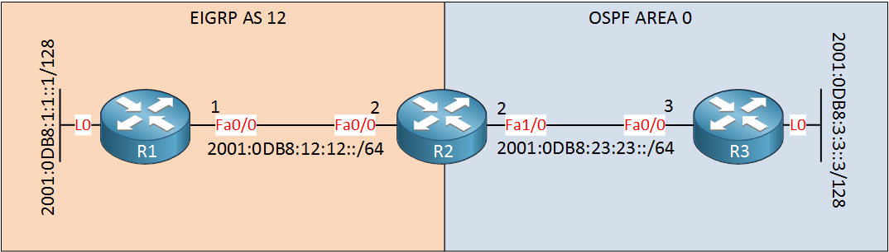

# Troubleshooting IPv6 Redistribution

This lab shows a small IPv6 redistribution issue between EIGRPv6 and OSPFv3.

R1 and R2 run EIGRP AS 12. R2 and R3 run OSPFv3 area 0. R2 redistributes between both protocols.



## Topology

- R1-R2: `2001:DB8:12:12::/64`
- R2-R3: `2001:DB8:23:23::/64`
- R1 Loopback0: `2001:DB8:1:1::1/128`
- R3 Loopback0: `2001:DB8:3:3::3/128`

R2 is the redistribution point. In OSPF terms, it is the ASBR.

## Problem

The loopbacks are redistributed correctly:

```text
R1 learns 2001:DB8:3:3::3/128 as EIGRP external.
R3 learns 2001:DB8:1:1::1/128 as OSPF external.
```

But the transit networks can be missing:

```text
2001:DB8:12:12::/64
2001:DB8:23:23::/64
```

That matters because a ping can use the outgoing physical interface as the source. For example, R1 may ping R3's loopback using source `2001:DB8:12:12::1`. If R3 does not know how to reach `2001:DB8:12:12::/64`, the reply fails even though R1 has a route toward R3.

## Root Cause

IPv6 redistribution is strict about connected routes.

This command:

```text
redistribute eigrp 12
```

redistributes EIGRP-learned routes into OSPFv3, but it does not automatically include connected prefixes from EIGRP-enabled interfaces.

Same idea in the other direction:

```text
redistribute ospf 1 metric 100000 10 255 1 1500
```

redistributes OSPF-learned routes into EIGRPv6, but it does not automatically include connected prefixes from OSPF-enabled interfaces.

## Fix

On R2, add `include-connected` to both redistribution commands:

```text
ipv6 router eigrp 12
 redistribute ospf 1 metric 100000 10 255 1 1500 include-connected

ipv6 router ospf 1
 redistribute eigrp 12 include-connected
```

This includes the connected transit prefixes that belong to the redistributed protocol side.

## Verification

On R1, the OSPF-side transit subnet should appear as an EIGRP external route:

```text
show ipv6 route eigrp
```

Expected:

```text
EX 2001:DB8:23:23::/64
EX 2001:DB8:3:3::3/128
```

On R3, the EIGRP-side transit subnet should appear as an OSPF external route:

```text
show ipv6 route ospf
```

Expected:

```text
OE2 2001:DB8:12:12::/64
OE2 2001:DB8:1:1::1/128
```

Ping the loopbacks:

```text
R1# ping 2001:DB8:3:3::3 source loopback0
R3# ping 2001:DB8:1:1::1 source loopback0
```

Then test using the physical interface source as well:

```text
R1# ping 2001:DB8:3:3::3 source 2001:DB8:12:12::1
R3# ping 2001:DB8:1:1::1 source 2001:DB8:23:23::2
```

## Notes

- `OE2` means OSPF external type 2.
- `EX` means EIGRP external.
- EIGRP needs a seed metric when redistributing OSPF routes into it.
- The EIGRP seed metric order is `bandwidth delay reliability load mtu`.
- `include-connected` is the key IPv6-specific lesson here.
